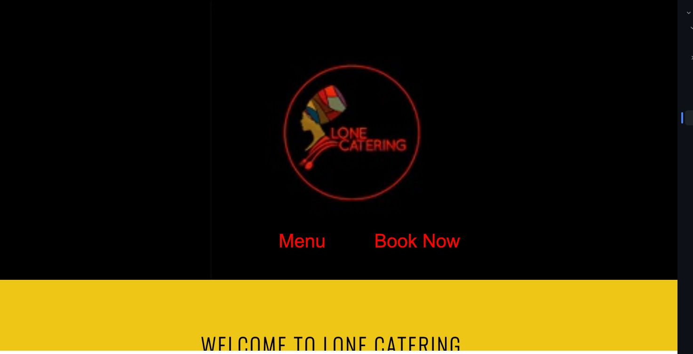
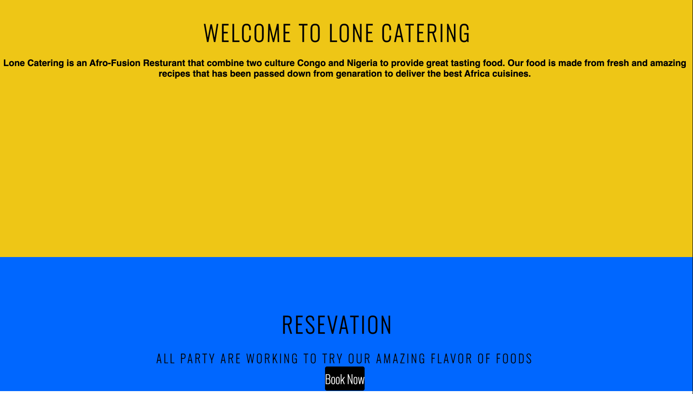
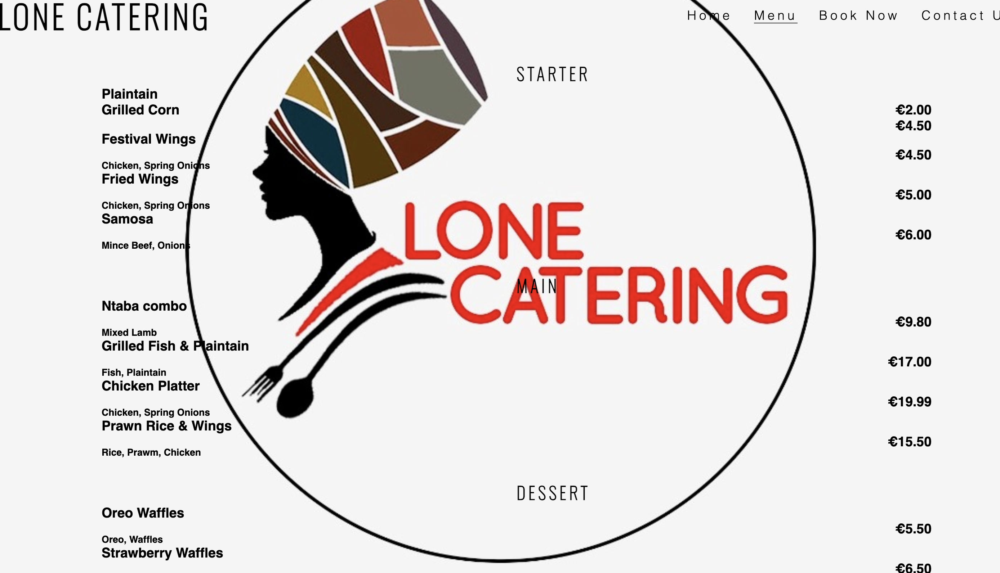
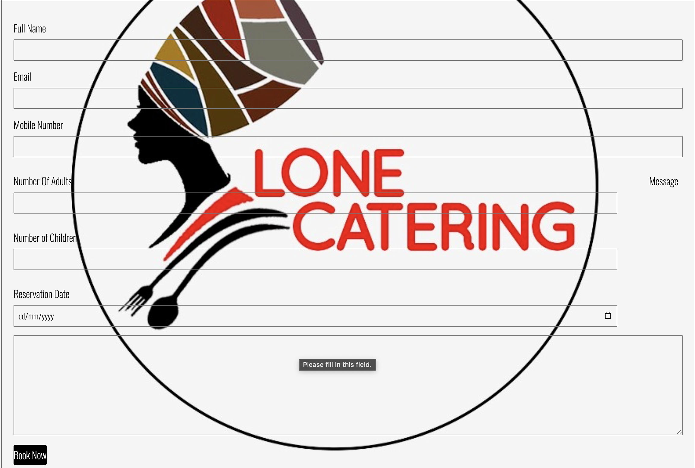
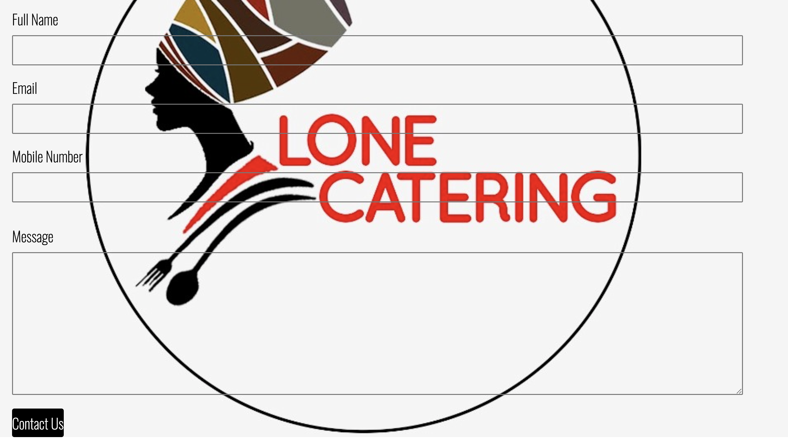
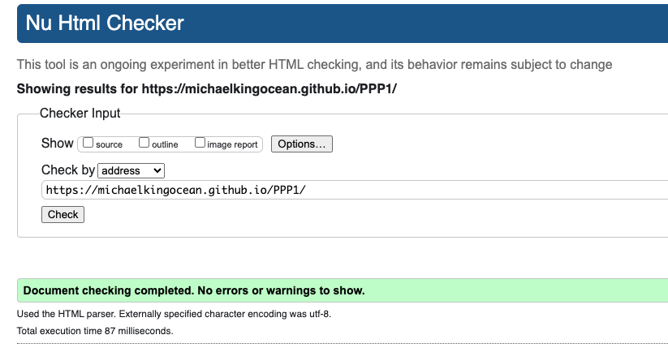
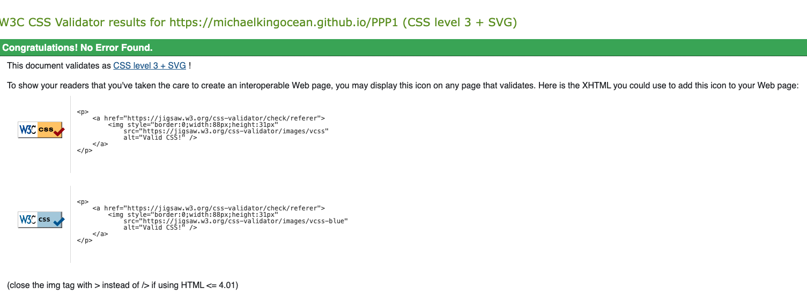
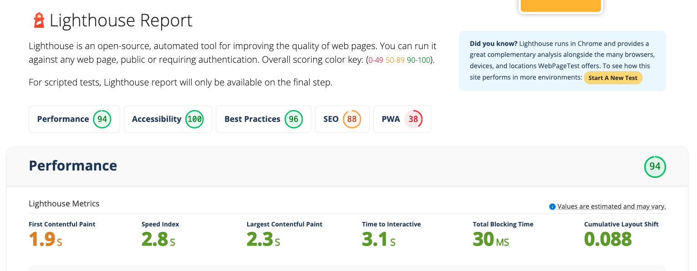

# Lone Catering
A website for Afro Fusion Food.

# The Purpose of this project
This wesite is made and targeted for Families and Friend . Food is everywhere a lot of people are passion about food, Lone carting offers a solution to people looking to try authentic african cuisine.
The site is very simple and easy to navigate, it doesn't have a lot of information but it has information on what you need to know.

To use the site, here is the URL:

https://michaelkingocean.github.io/PPP1/

# Table of Contents

User Demographic
Requirements
Features
Technologies 
Design
Testing
Validator Test
Development and Deployment
Content
Media

# User Demographic

Family and Friend looking to get Afro Fusion Food

Organise Party and Catering

Cheap and affordable Food Prices

User Goal:

Schedule catering for event.

Ensure that Food and Recipes are catered to user with allergies

Offer excellent catering service

# Requirments

A Webiste that is designed from material that has been learnt from the code so far and also reference to the sample Love Running Project.

# Features

Lone Catering has three pages:
A home page that has a hero Image and a small informatin about the site.

A Menu page that has list of Food and price

Another Page is the Book Now page this page is looking for user information who are looking to book 

Last Page is the contact us page just for people to leave comment, contact us or leave feedback.

A header with a simple logo and a navigation bar to the right 

A footer with the links to the social media for Lone Catering.

# Technologies

HTML
CSS
GitHub

# Design

As this is my first project it is clear to see that some parts of the project is from what i have learnt sor far in the course,footer design, Position of div and other example are from the love running project, other ideas are from try and also using W3 school to educate my self.

My goal start a website that over time and be devolpement has a personal project fior my patner business.

Lone Catering is a website made of 4 pages and can be navigated from one to another.                                                                                                                                  
# Testing

Tetsed using Google Chrome. Tested different device and screen resolutions and inspeted with GOogle DevTools.

Most of the problem faced come when its time to ajust the section and also the Menu and BookNow links on the Hero Image. Also when using the small screen size the hero image content goes out of frame.

# Validator Testing 

Html: No erros were returned when passing the offical W3C validator.

CSS: No error found in the official CSS validator

Lighthouse testing:

#Development and Deployment

This project was developed using Notpad ++ the transffered to codeanywhere. Used Github commints and push to handle different stages and version of the project.

The Live version was deployed using Github Pages has demonstrated in the Love Running project

Followed the step to create the site

Logged into GitHub.
Access my GitHub Reposistory for this project.
Clicked on the setting option 
On the Left side on the page, selected the GitHub Pages
In the Pages section under Build and Deployment, changed the Branch from None to Main.
Click save and a project link was generated.

Link to live page below:

https://michaelkingocean.github.io/PPP1/

